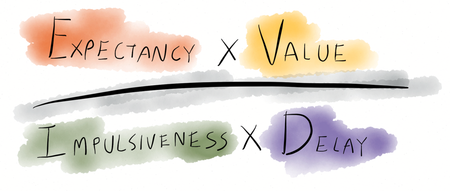
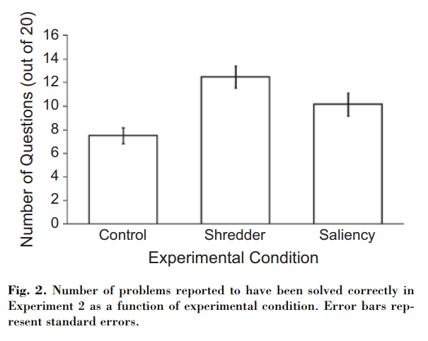
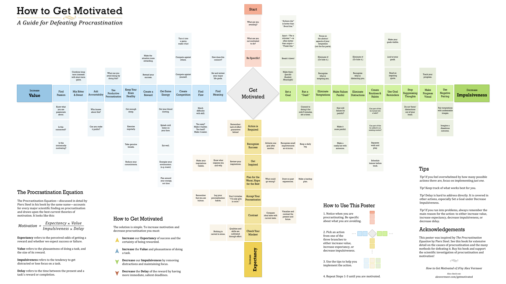
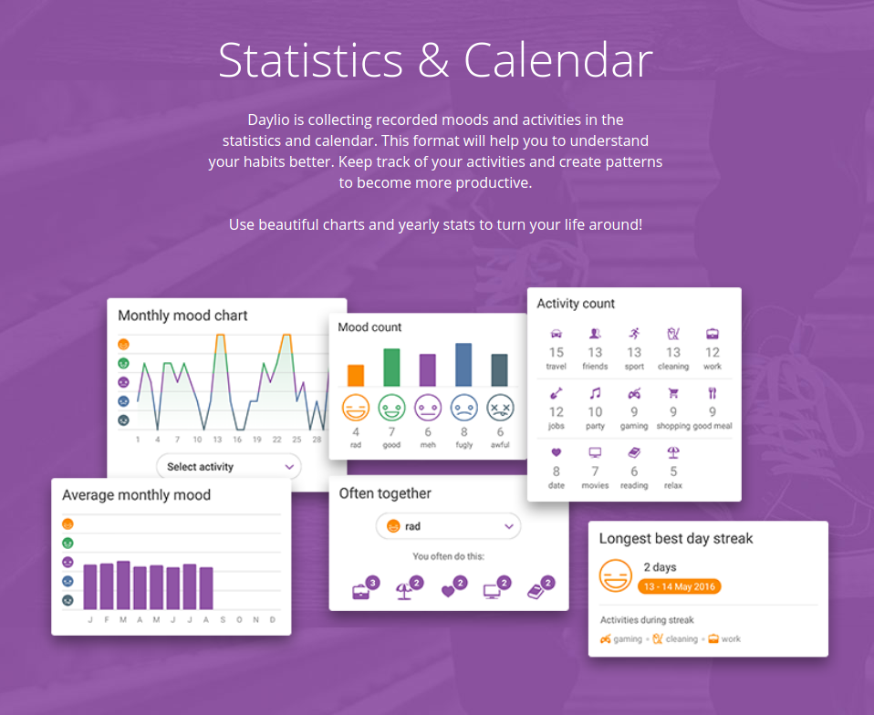
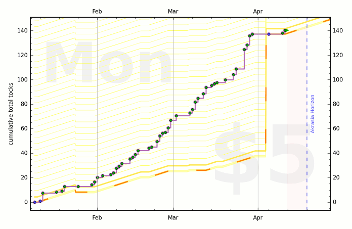
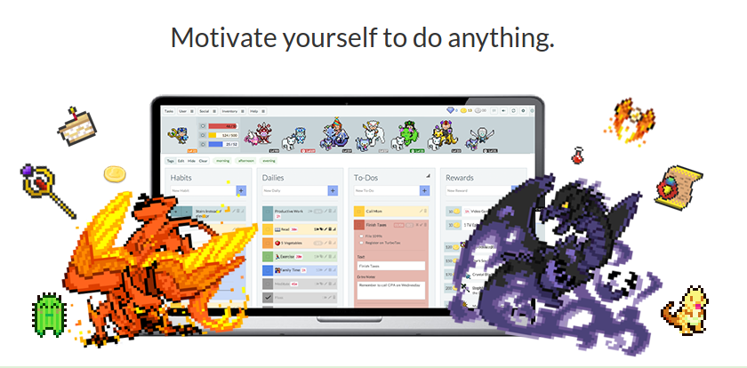
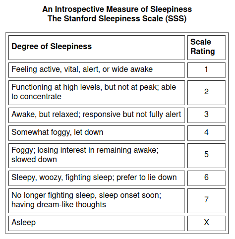

# <!--fit--> Motivation equation

Что это такое и как использовать на себе

---

# Кто я такой и почему меня можно слушать

* Привет, меня зовут Игорь :wave:
* Занимаюсь машинным обучением в Ламода :dragon: :man_technologist:
* У меня суровый академический бэкграунд :man_scientist:
* Увлекался тайм-менеджментом _когда это было ещё модно_
* Делал большие сложные вещи через не хочу :cactus: :muscle: :triumph:

---

# Дисклеймер (соломка)

* Я технарь, а не психолог :robot:
* В речи много англицизмов :gb:
* Могу сказать что-то недоцензурное :speech_balloon:

_(ну очевидно) всё сказанное &mdash; моё мнение, никак не связанное с&nbsp;Ламодой_

---

# О чём поговорим :thinking:

- Доклад про мотивацию самого себя, а не кого-то другого
- Речь про мотивационное уравнение и как его использовать
- Разберём как влиять на факторы
- И какие есть сервисы и инструменты для этого

---

# Мотивационное уравнение

Доктор Пирс Стил исследовал прокрастинацию и десять лет назад опубликовал метаанализ всех работ по теме прокрастинации и мотивации

Основной результат &mdash; уравнение из 4 базовых факторов

###### Dr. Steel Piers &laquo;The Procrastination Equation&raquo; 2010

---

---

$$ Мотивация = \frac{Оптимизм \times Ценность}{Импульсивность \times Срочность } $$

---

# Смотрим на числитель (это сверху)

$$ Мотивация = \frac{\bold{Оптимизм} \times Ценность}{Импульсивность \times Срочность } $$

---

# Оптимизм (Expectancy)

Можно ещё сказать &laquo;Ожидание успеха&raquo; &mdash; это вера в то что у вас получится задуманное. Чем выше уверенность тем выше оптимизм, тем выше мотивация.

Исследования показывают, что оптимизм это кросс-доменная штука:

Научился жонглировать: вера в себя &uarr;

Сгорел пирог в духовке: вера в себя &darr;

---

# Как влиять на оптимизм :question:

* Быть счастливым 🥳:tada: :performing_arts:
* Всегда можно найти недостаток витамина (например, D3) :pill:
* Если вам долго грустно, поговорите с кем-то! :speak_no_evil:

---

# Декомпозиция задач

- каждый этап сам по себе меньше
- можно делать себе награду за этапы :star2:
- достижимость: &laquo;эта задача со мной не навсегда&raquo; :hourglass_flowing_sand:

---

# :cyclone: Спираль успеха и спираль неудачек

* когда всё не очень, начинаешь с мелкого 
* упор на постоянноство
* кросс-доменное &laquo;опыление&raquo; :art: :drum: :saxophone: :person_fencing: :skier: :boxing_glove:

---

# Как влиять на оптимизм

Самый полезный трюк: переформулировка целей  Input &rarr; Output

---

# Пример: чтение книг

* Читать 2 книги/месяц :x:   10+ страниц/день :heavy_check_mark:

* Читать N страниц в день :x:   30 минут в день :heavy_check_mark:
* Читать 30 минут в день :x:   3 часа в неделю :heavy_check_mark:

---

# Физиология: трюки с едой

* завтрак +/-/? 🍳
* вода +, кофе - или наоборот :coffee: 💧
* есть злаковые :bread: :pancakes:
* не есть злаковые
* есть мясо :poultry_leg: :bacon:
* не есть мясо :green_salad:

---

# Ещё физиология: сон :sleeping:

* Спать можно больше: чаще, но покороче
* Спать можно реже, но подольше

* Спать можно в других условиях
    * В комнате темнее или холоднее
    * Кровать жёстче или мягче

---

$$ Мотивация = \frac{Ожидание\; успеха \times \bold{Ценность}}{Импульсивность \times Срочность } $$

---

# Ценность (Value)

Отвечает на вопрос &laquo;зачем мне это?&raquo;, мера внутреннего удовлетворения от результата выполнения задачи.

---

# Как влиять на фактор ценности

* Избегать негативно настроенных знакомых :japanese_ogre: :japanese_goblin:
* Внедрять гамификацию :game_die: :joystick: :space_invader:
* Много думать о культурной идентичности и личных ценностях :thinking: :shinto_shrine:

---

# Shredder effect

### или &laquo;как убить ценность&raquo;

Психологический эксперимент:

- Контроль
- fake шреддер
- Игнор результата

`Шреддер` $\approx$ `Игнор`

---

Это всё хорошо, но давайте посмотрим теперь на примеры сразу со всеми 4 факторами:

- Помодоро
- Курсовая работа
- Работа по спринтам

---

# Пример №1. Техника &laquo;помодоро&raquo; :tomato:

(25 минут работа + 5 минут перерыв) x 4 раза

Снижает срочность, увеличивает ожидание успеха. На долгой перспективе снижает импульсивность 

 

$$ Мотивация = \frac{Ожидание\; успеха \Uarr\times Ценность}{Импульсивность \times Срочность\Darr} $$

---

## Пример №2. Курсовая работа. Первая неделя обучения

Срочность **низкая**, оптимизма **нет**, ценность **конечная**, импульсивность **запредельная**.

Будем что-то маленькое обозначать как $\varepsilon$, а что-то большое как $\infty$. Другие значения будем обозначать как $C$ &mdash; какие-то константы.

 

$$ Мотивация = \frac{Ожидание\; успеха \times Ценность}{Импульсивность \times Срочность} $$

---

## Пример №2. Курсовая работа. Первая неделя обучения

Срочность **низкая**, оптимизма **нет**, ценность **конечная**, импульсивность **запредельная**.

Будем что-то маленькое обозначать как $\varepsilon$, а что-то большое как $\infty$. Другие значения будем обозначать как $C$ &mdash; какие-то константы.

 

$$ Мотивация = \frac{Ожидание\; успеха \times Ценность}{Импульсивность \times Срочность} $$

$$ Мотивация = \frac{\varepsilon_1 \times C_1}{\infty\times C_2} \approx 0 $$

---

## Пример №3. Курсовая работа. Пора сдавать.

Срочность &mdash; **&laquo;ААААА&raquo;**, оптимизм &mdash; **есть** (разбирали похожие задачи в семестре), ценность&nbsp;&mdash;&nbsp;**конечная**, импульсивность **высокая**.

 

$$ Мотивация = \frac{Ожидание\; успеха \times Ценность}{Импульсивность \times Срочность} $$

$$ Мотивация = \frac{C_1 \times C_2}{C_3\times \varepsilon} = \infty$$

---

## Пример №4. Работа по спринтам

Срочность **до конца спринта&raquo;**, оптимизм &mdash; **есть**$^*$, ценность&nbsp;&mdash;&nbsp;**зарплата**, импульсивность **конечная**.

 

$$ Мотивация = \frac{Ожидание\; успеха \times Ценность}{Импульсивность \times Срочность} $$

$$ Мотивация = \frac{C_1 \times C_2}{C_3\times C_4} $$

---

# Опасности и нюансы

* Можно убедить себя делать то что ты не хочешь :-1:
* Затяжная апатия &mdash; гарантия что ценности нет ни в чём
* Если несколько раз сильно "пробить" срочность, она перестанет пугать, и заодно уронит ценность 

---

# Все факторы нелинейны и непостоянны во времени

* зарплата не может быть единственной ценностью
* делать похожие таски хорошо для фактора "оптимизм"
* делать похожие таски скучно &mdash; бьёт в фактор "ценность"

---

# Let's geek out

Ресурсы и приложения

---

# Мотивационное уравнение

* Интерактивный флипчарт с советами https://whydoiprocrastinate.com/
* Неинтерактивный флипчарт с советами: постер [How to get Motivated](http://alexvermeer.com/getmotivated/)
* Книжка Nick Winter ["Motivation Hacker"](http://www.nickwinter.net/the-motivation-hacker)

---

---

# Несколько скриншотов

---

---

# Beeminder

* Срочность
* Ожидание успеха
* Ценность?
         

---

# Приложения и сервисы

* трекер настроение/состояния [Daylio](https://daylio.webflow.io/). Надо переждать период сбора данных прежде чем делать хоть какие-то выводы. Я сейчас собрал 500 дней, первые полезные инсайты были на 200+ днях
* приложение для медитаций: [Headspace](https://headspace.com/)
* гамификация списка дел: [Habitica](https://habitica.com/static/home)
* ограничение интернета: [freedom](https://freedom.to/) или [stayfocusd](http://www.stayfocusd.com/)
* сбор статистики по делам: [rescuetime](https://www.rescuetime.com/), [tagtime](http://tagti.me/)$^*$
* сбор статистики позлее: [beeminder](https://www.beeminder.com/)$^*$

Звёздочкой отмечены наиболее гиковые тулзы

---

# Спасибо за внимание!

Если что, пишите:

* twitter/telegram @shripmsizemoose
* fb.me/imosyagin
* c6h10o5@gmail.com

---
<!-- _backgroundColor: red
_color: white -->

(дальше дополнительные слайды)

---

# Habitica
 
 
 
 
 
 
 
 
 

Ожидание успеха, Ценность, Срочность(?)

---

# Quantified Self

QS &mdash; движение про самопознание через количественные измерения.

---

# Принципы QS

* Метрики это здорово. Неэффективная или неоптимальная метрика лучше чем никая
* Важно знать свой &laquo;baseline&raquo;, прежде чем вносить изменения
* Автоматизация сбора и обработки данных делает их честнее и полезнее
* Про некоторые данные нельзя ничего сказать пока их не наберётся достаточно много

---

# Где брать шкалы измерения?

Всё уже придумано за&nbsp;нас

---

# Алгоритм применения улучшений &laquo;по QS&raquo;

1. Выбрать, на чём сфокусироваться
2. Оценить результат, желательно измеримо
3. Найти и/или придумать подходящие метрики
3. Первые пару недель определять по метрикам своё «текущее состояние»
3. Найти 2-3 минимально простые вещи, которые, возможно, будут влиять на метрики
3. Начать внедрять одну из них
3. Внедрить. Собрать данные за пару недель
3. Проанализировать результаты
3. Сделать выводы
3. Вернуться к пункту 1.
